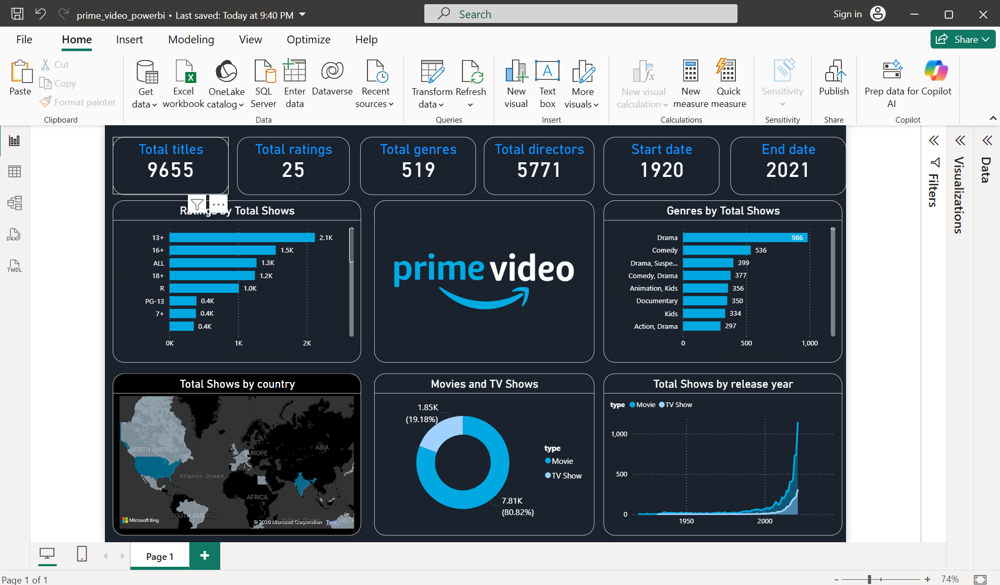

📊 Amazon Prime Video Data Analysis Dashboard (Power BI)

📌 Project Overview

This project presents an interactive Power BI dashboard that analyzes the Amazon Prime Video dataset.
The dashboard provides insights into Prime Video content including titles, genres, ratings, release trends, and geographical distribution.

The objective of this project is to demonstrate data visualization, data analysis, and dashboard design skills using Power BI.

🎯 Key Insights from the Dashboard

The dashboard highlights several important insights about Prime Video content:

- Total number of titles available on Prime Video
- Distribution of content ratings
- Most popular genres available on the platform
- Comparison between Movies and TV Shows
- Content distribution across different countries
- Growth of Prime Video content over the years

📈 Dashboard Visualizations

1️⃣ Total Titles

Displays the total number of shows available on Prime Video.

2️⃣ Ratings by Total Shows

Shows the distribution of titles across different content ratings.

3️⃣ Genres by Total Shows

Highlights the most common genres available on Prime Video.

4️⃣ Movies vs TV Shows

Compares the proportion of Movies and TV Shows in the dataset.

5️⃣ Total Shows by Country

A map visualization that shows which countries produce the most Prime Video content.

6️⃣ Total Shows by Release Year

Displays how the number of shows released on Prime Video has grown over time.

---

🛠 Tools and Technologies Used

- Power BI Desktop
- Data Visualization Techniques
- Amazon Prime Video Dataset (CSV)

---

📂 Project Files

- "prime_video_powerbi.pbix" – Power BI dashboard file
- "amazon_prime_titles.csv" – Dataset used for analysis
- "Dashboard.png" – Screenshot of the dashboard

---

📷 Dashboard Preview

"Dashboard" (Dashboard.png)

📊 Conclusion

This project demonstrates how Power BI can transform raw data into meaningful insights through interactive visualizations.
The dashboard provides a clear overview of Prime Video content trends such as genre popularity, ratings distribution, and content growth over the years.

Author
Indusri Chenna
